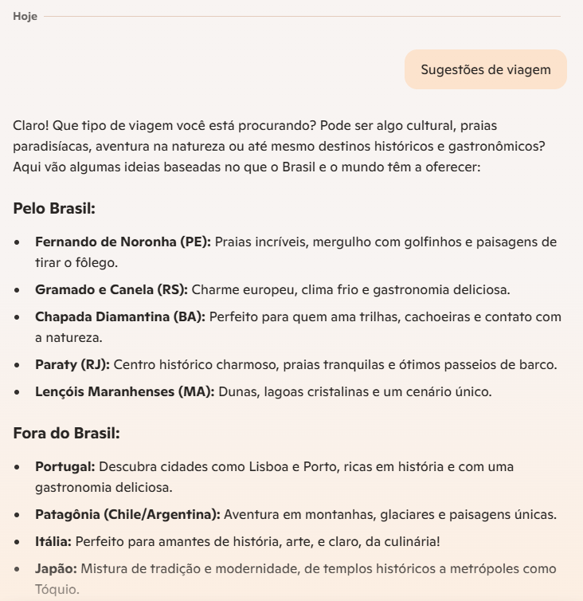
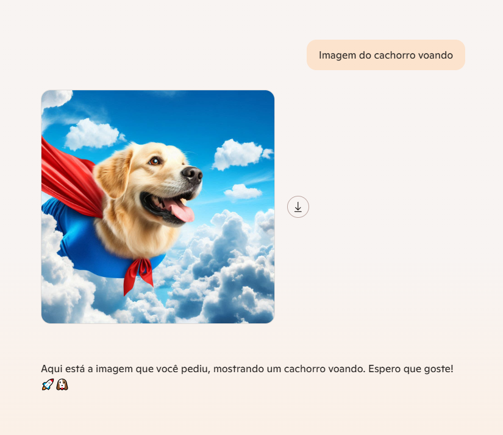

# Explorando IA Generativa com Microsoft Copilot e Azure OpenAI  

Este projeto explora o potencial da **IA Generativa** com **Microsoft Copilot** e **Azure OpenAI**, destacando como essas ferramentas podem ser utilizadas para criar ideias, gerar imagens e aplicar filtros de conteúdo.

## 1. Explorando o Microsoft Copilot  

O **Microsoft Copilot** é uma IA assistiva que ajuda a gerar ideias, responder perguntas e otimizar tarefas.  

### Exemplo: Gerando Ideias para Viagens  
Um dos testes foi pedir sugestões de viagens. A IA gerou respostas completas com recomendações baseadas no perfil desejado.  

**Exemplo de prompt:**  
*"Quais são alguns destinos exóticos para viajar sozinho?"*  

**Print do resultado:**  
  

---

## 2. Explorando o Azure OpenAI  

O **Azure OpenAI** permite acessar modelos avançados da OpenAI para criar textos, códigos e até imagens.  

### Exemplo: Gerando uma imagem com IA  
Foi utilizado o **DALL·E** para gerar uma imagem de um cachorro voando.  

**Exemplo de prompt:**  
*"Crie uma imagem de um cachorro voando no céu com asas de anjo."*  

**Print do resultado:**  
  

---

## 3. Explorando filtros de conteúdo no Azure OpenAI  

O **Azure OpenAI** conta com **filtros de segurança** para garantir que o conteúdo gerado respeite diretrizes éticas e evite respostas inadequadas. Durante os testes, observou-se que:  
- O sistema bloqueia conteúdos sensíveis automaticamente.  
- Há configurações ajustáveis para reforçar a moderação dos resultados.  

---

## Insights e possibilidades  

**Criatividade aumentada**: IA como assistente para brainstorms e geração de conteúdo.  
**Geração de imagens avançada**: Modelos como DALL·E são úteis para ilustrações rápidas.  
**Segurança**: Filtros de conteúdo garantem um uso mais responsável da IA.  
**Personalização**: Copilot e Azure OpenAI podem ser ajustados para atender diferentes necessidades.

**Conclusão:** A IA generativa já é uma ferramenta essencial para produtividade e criatividade. Combinando **Microsoft Copilot** e **Azure OpenAI**, podemos expandir as possibilidades em diferentes áreas, desde planejamento de viagens até criação de imagens inovadoras.  
